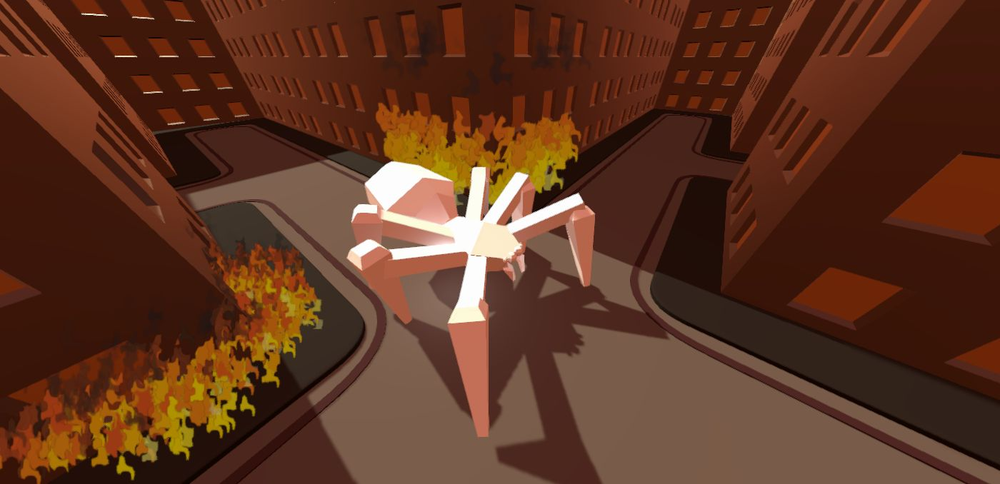

# SpAIder_bot

El robot aranya ha de mapejar una ciutat per trobar tots els tokens i passar al següent nivell. 

# Taula de continguts
  * [Que és això?](#que-és-això)
  * [Requisits](#requisits)
  * [Documentació](#documentació)
  * [Com utilitzar-ho](#com-utilitzar-ho)
  * [Mapeig](#mapeig)
  * [Moviment](#moviment)
  * [Autors](#autors)

# Que és això?

Una aranya gegant es troba en una ciutat generada aleatòriament, l’aranya ha de moure’s per la ciutat buscant les fiches per avançar al següent nivell, per fer això anirà guardant els encreuaments que es va trobant i a partir d'aquí anirà prenent els diferents camins de cada encreuament fins que hagi recollit tots els tokens.

# Requisits

- Unity (> 2019.3.7f1)

# Com utilitzar-ho

En pimer lloc s'ha de descarregar el repositori
`git clone https://github.com/MayitaMayoso/SpAIder-bot.git`

## Per executar el programa:
Afegint el projecte com a projecte de Unity a la versió especificada anteriorment hauria de ser suficient per poder executar-lo.

Després d'afegir el projecte i obrir-lo, executar el projecte amb el botó superior PLAY posaría en funcionament el programa.

## Per executar els tests:

S'executen els escenaris de test i autimaticament podem veure per consola o a través de la simulació l'execució de tests.

# Mapeig

L'aranya és capaç de recordar cadascun dels encreuaments i quins camins ha explorat. Quan es troba en un cami ja explorat, l'aranya prioritza els camins no explorats o menys explorats.

# Moviment

El moviment de l'aranya implica una modificació de la posició de les seves potes, simulant el moviment mitjançant un Inverse Kinematics.

# Autors

Roger Boadella

Jordi Sanz

Alex Velasco

Agustin Molina
